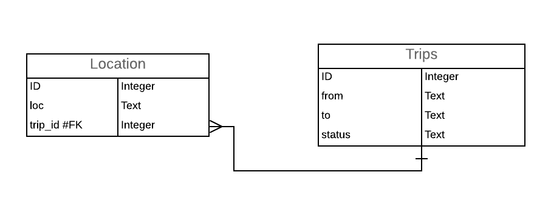
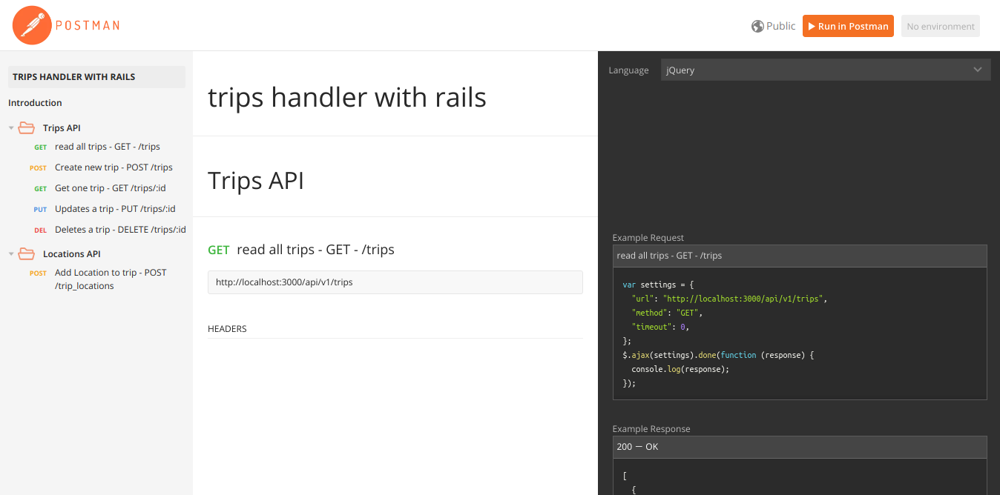

# Trips Handler

The purpose of this project is to make a simple CRUD operations on the trips table as well as inserting trips locations.

## System dependencies

This project is well tested on Ubuntu 18.04 and should be compatible with Ubuntu 16.04 as well as Windows and macOS.

## Configuration

* Clone this repo to your local machine.
* Install ruby, you can follow the instructions in this link to help you install it on Ubuntu:
<a> https://linuxize.com/post/how-to-install-ruby-on-ubuntu-18-04/</a>
* install rails, check this link for more details :
<a>https://guides.rubyonrails.org/v5.0/getting_started.html </a>
* Navigate to the folder from your terminal
* Type ``` bundle install ``` for installing all the project packages.
* configure the database username and password in ``` config/database.yml ```
* Run the Project by typing ``` rails s ```.

##  Database creation

If You faced any problem with the database then try creating it with the name ``` trips_handler_development ```, and note that it's a PostgreSQL Database not sqlite.

## Database Schema and ERD

As you can see in ``` db/schema.rb``` file the schema goes as follows:

```
  create_table "locations", force: :cascade do |t|
    t.text "loc"
    t.integer "trip_id"
    t.datetime "created_at", null: false
    t.datetime "updated_at", null: false
  end

  create_table "trips", force: :cascade do |t|
    t.text "from"
    t.text "to"
    t.string "status"
    t.datetime "created_at", null: false
    t.datetime "updated_at", null: false
  end

  add_foreign_key "locations", "trips"

```
And For more readable and simpler view check this ERD :



## POSTMAN Documentation

You can find in this <a>https://documenter.getpostman.com/view/4628217/RzteTCvg
</a> a POSTMAN documentation for the provided end-points, each end-point comes with an example or more to what should this end-point return.

As you can see in the screenshot below you can find the end-points on the left, description in the middle and examples in the left.



## Finished items

* CRUD operations on the Trips with handeling the most failure scenarios using response codes as well as following rails conventions.

* Insertion of trips locations - For this part it should have been implemented using Background jobs but sadly I couldn't reach that part in the required duration -

* Used caching on the Read operations in trips.

* Created PostMan API Happy Scenareo testing with Examples
